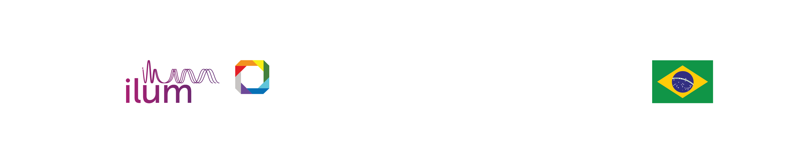

<!-- @format -->

<h1 align="center">
UMAP - <i>Uniform Manifold Approximation and Projection</i>
</h1>

  <i>Notebbok didático sobre o algorítimo de redução de dimensionalidade UMAP</i> 
  Ilum - School of Science | Campinas, 2026

  
  
  <!--  -->

<!--  -->

## Sobre o repositório

---

## Conteúdos do repositório

---

## Descrição do uso de IA neste trabalho

---

## Agradecimentos

---

## Professor orientador

<table>
  <tr>
    <td align="center">
      <a href="https://github.com/drcassar">
         
        <b>Prof. Dr. Daniel R. Cassar</b>
      </a>
    </td>
  </tr>
</table>

---

## Autor

<table>
  <tr>
    <td align="center">
      <a href="https://github.com/FipaLipe">
         
        <b>Filipi Martins</b>
      </a>
    </td>
  </tr>
</table>
